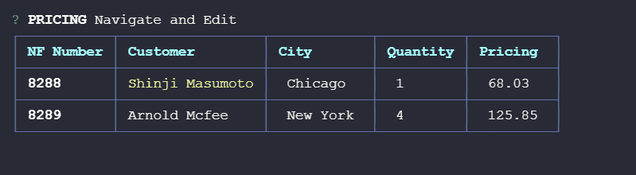

# inquirer-table-input [](https://badge.fury.io/js/inquirer-table-input)

> An editing table prompt for [Inquirer.js](https://www.npmjs.com/package/inquirer)



## Installation

```
npm install --save inquirer-table-input
```

## Usage

After registering the prompt, set any question to have `type: "table-input"` to make use of this prompt.

```js
const chalk = require("chalk");
const inquirer = require("inquirer");
const TableInput = require("inquirer-table-input");

inquirer.registerPrompt("table-input", TableInput);

inquirer
  .prompt([
    {
      type: "table-input",
      name: "pricing",
      message: "PRICING",
      infoMessage: `Navigate and Edit`,
      hideInfoWhenKeyPressed: true,
      freezeColumns: 1,
      decimalPoint: ".",
      decimalPlaces: 2,
      selectedColor: chalk.yellow,
      editableColor: chalk.bgYellow.bold,
      editingColor: chalk.bgGreen.bold,
      columns: [
        { name: chalk.cyan.bold("NF Number"), value: "nf" },
        { name: chalk.cyan.bold("Customer"), value: "customer" },
        { name: chalk.cyan.bold("City"), value: "city", editable: "text" },
        {
          name: chalk.cyan.bold("Quantity"),
          value: "quantity",
          editable: "number"
        },
        {
          name: chalk.cyan.bold("Pricing"),
          value: "pricing",
          editable: "decimal"
        }
      ],
      rows: [
        [chalk.bold("8288"), "Shinji Masumoto", "Chicago", 1, 68.03],
        [chalk.bold("8289"), "Arnold Mcfee", "New York", 4, 125.85]
      ],
      validate: () => false /* See note ¹ */
    }
  ])
  .then(answers => {
    console.log(answers);
  });
```

> ¹ This extension of Inquirer was programmed to enable quick table editing, so it's common for users to use the ENTER key to confirm after updating a cell. However, by default, Inquirer was designed so that when ENTER is used, it concludes the answer, and this has become a problem for the purpose of this extension. Therefore, it is essential here to force VALIDATE to be FALSE so that the accidental triggering of ENTER does not correspond to the completion of the answer.

The result will be an array, containing the value for each row.

```json
{
  "pricing": {
    "state": true,
    "result": [
      {
        "nf": "8288",
        "customer": "Shinji Masumoto",
        "city": "Chicago",
        "quantity": "1",
        "pricing": "68.03"
      },
      {
        "nf": "8289",
        "customer": "Arnold Mcfee",
        "city": "New York",
        "quantity": "4",
        "pricing": "125.85"
      }
    ]
  }
}
```

### Options

- `infoMessage`  <kbd>_Optional_</kbd> A message that will appear after the <kbd>message</kbd> argument.
- `hideInfoWhenKeyPressed` <kbd>_Default: **false**_</kbd> The <kbd>infoMessage</kbd> disappears after any key is pressed.
- `freezeColumns`  <kbd>_Default: **0**_</kbd> The number of frozen columns, preventing navigation and editing of them.
- `decimalPoint`  <kbd>_Default: **'.'**_</kbd> The decimal point used to represent editable columns of the "decimal" type.
- `decimalPlaces`  <kbd>_Default: **2**_</kbd> The decimal places used to represent editable columns of the "decimal" type.
- `selectedColor` <kbd>_Default: **chalk.yellow**_</kbd> The color used to represent the currently selected cell.
- `editableColor`  <kbd>_Default: **chalk.bgYellow.bold**_</kbd> The color used to represent when a selected cell can be edited.
- `editingColor`  <kbd>_Default: **chalk.bgGreen.bold**_</kbd> The color used to represent when a cell is being edited.
- `escapeMessage`  <kbd>_Default: **chalk.red("Press ESC again to exit!")**_</kbd> Alert message that will appear when the user tries to cancel by pressing the ESC key.
- `confirmMessage`  <kbd>_Default: **chalk.green("Press ENTER again to confirm!")**_</kbd> Alert message that will appear when the user tries to confirm by pressing the ENTER key.
- `columns` A array of objects that represent the columns of your table.
  - `name` The title that will represent the column (the one visible to the user).
  - `value` The name of the columns (Used to structure the result of the Inquirer response.)
  - `editable`  <kbd>_Optional_</kbd> When used, it determines the type of the field to be edited, with options including "**text**", "**number**", and "**decimal**."
- `columns` A array of values that represent the items of your table. The size of each array should represent the same number of columns in your table.

### Acknowledgments

Thanks to [Eduardo Bouças](https://github.com/eduardoboucas), creator of [inquirer-table-prompt](https://github.com/eduardoboucas/inquirer-table-prompt), which inspired me to create this project.
